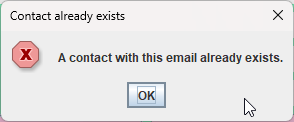

# MAIL CLIENT IN JAVA WITH GUI

## Overview
The goal of this project was to create a simple Java program capable of sending mail while utilizing a GUI made with javax.swing and java.awt. Sending mail is handled by the Simple Java Mail library utilizing the Simple Mail Transfer Protocol. 

## Table of Contents
- [Detailed Description](#detailed-description)
- [Project Structure](#project-structure)
- [Features](#features)
- [Preview of The Application](#preview-of-the-application)
- [Technologies Used](#technologies-used)
- [Implementation Details](#implementation-details)
- [Future Work](#future-work)

## Detailed Description
This project was focused around learning the basics of java-based GUI and the use of external libraries. The GUI was created with the help of JPanel using different kinds of layouts (BorderLayout, FlowLayout, GridBagLayout). There are 4 window classes responsible for creating windows for: the main window of the application, capable of displaying sent emails, a window for adding a recipient and their email address, choosing an existing recipient from the previously added email addresses and a window for writing new emails. Sending mail is possible through the use of the Simple Java Mail library, with a hard-coded connection to Google's SMTP server using their App Password option for authentication (**_for privacy reasons, these fields have been left empty in the source code, but can be filled in after downloading the repo if necessary_**).

The stages of the project were:
- importing the Simple Java Mail library
- creating the main window of the application with the ability to display sent emails
- creating additional windows responsible for writing emails and adding/selecting recipients
- using javax.swing and java.awt to give the application a cohesive look

## Project Structure
```src/main/java``` contains all the class files for the application. In the ```src/main/resources``` directory, there are two .png files used as icons in the main window. The ```out/artifacts``` directory contains a jar file of the application, with dependencies iuncluded.

## Features
- GUI with 4 different windows for displaying emails, contacts and recipients
- the ability to compose and send emails using SMTP
- the ability to add recipients to a contacts list
- a simple regex for filtering incorrect email addresses (must contain symbols "@" and "." in the string and the app will not allow the address to be added to the contacts list)

### Preview of The Application
The main window of the application. On the left side, there is a list of sent emails that can be clicked on to see the message on the right side.
\


Email creation window.
\


Contact creation window.
\


Email validation example, the box turns red when the user inputs an incorrect value.
\


Error message example.
\


Recipient selection window.
\


## Technologies Used
The entire project was created using Java, utilizing:
- javax.swing
- javax.awt
- Simple Java Mail library
  
## Implementation Details
The GUI was created with the help of JPanel using different kinds of layouts (BorderLayout, FlowLayout, GridBagLayout). There are 4 window classes responsible for creating windows for: the main window of the application, capable of displaying sent emails, a window for adding a recipient and their email address, choosing an existing recipient from the previously added email addresses and a window for writing new emails. Sending mail is possible through the use of the Simple Java Mail library, with a hard-coded connection to Google's SMTP server using their App Password option for authentication (for privacy reasons, these fields have been left empty in the source code, but can be filled in after downloading the repo if necessary).

## Future Work
There are several shortcomings of this project that could be mitigated in the future. A better regex could be created for better email validation - as it is, the application will not check whether the domain the user inputs is valid. Another improvement would be to allow the user to input their login credentials to get rid of the hard-coded values in the code. Lastly, using a different library could potentially allow to receive email as well, though that would require a significant reworking of the current classes. 
